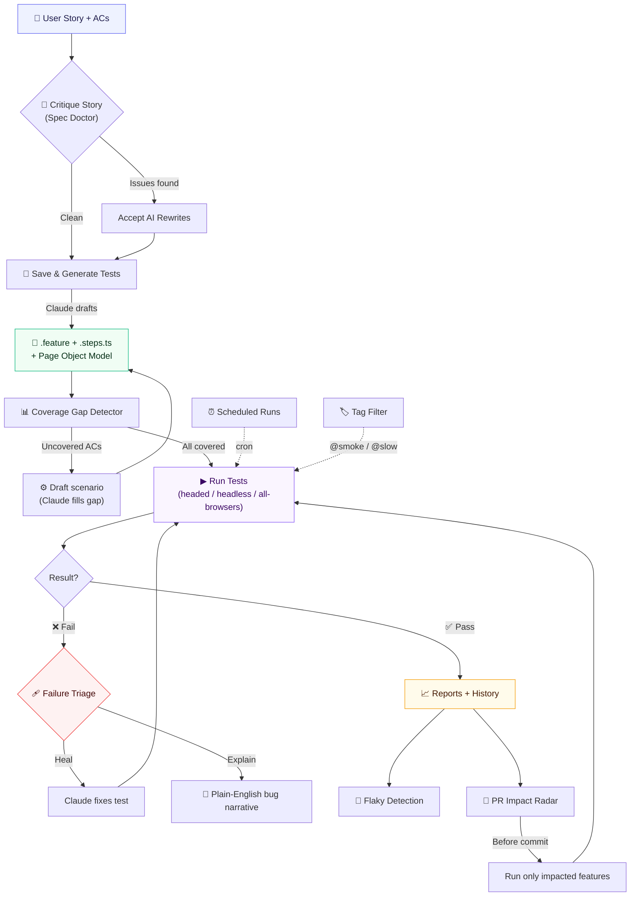

# Agentic QA Automation Pipeline

A local Playwright + BDD framework with a **visual test runner UI** on top. Turns user stories into executable browser tests, auto-heals failures, tracks flakiness, and tells you which tests to run before you commit.

> **No paid API required.** All AI features go through your local `claude` CLI (Claude Code subscription). Everything else — schedulers, tag management, PR impact analysis, coverage detection — is pure Node + Playwright, no third-party keys.

---

## Pipeline flow



The dashed arrows show cross-cutting features that plug into the same run pipeline: **Scheduled Runs** fire tests on a cron; **Tag Filter** narrows what runs.

---

## What's inside

| Capability | How to use |
|---|---|
| **Visual test runner** with NDJSON log streaming, run history sparkline, ETA | `npm run ui` → http://localhost:3001 |
| **Playwright + playwright-bdd** — Gherkin `.feature` scenarios, POM + shared step libraries | `features/<name>/*.feature` + `<name>.steps.ts` |
| **Story → Tests** — paste ACs, Claude scaffolds the full `.feature` + `.steps.ts` | `Save & Generate Tests` button |
| **Spec Doctor** — lints ACs for vague verbs, missing negatives, un-measurable outcomes | `Critique Story` button |
| **Coverage Gap Detector** — per-AC ✓/✗ with auto-fill for missing scenarios | Coverage panel + `Close N gaps` CTA |
| **Test Recorder** — Playwright codegen wrapped so captures become Gherkin | `Record New Scenario` button |
| **Failure Triage** — cards for each failure with **Heal** (Claude fix) + **Explain** (plain-English narrative) | Below the run status |
| **Auto-implement missing steps** — scans compiled BDD for undefined steps, drafts implementations | Amber banner during runs |
| **Liquid Step Timeline** — live green beams fill each Given/When/Then as they execute | Custom Playwright reporter (`ui/live-step-reporter.js`) |
| **Test Tags Manager** — add/remove `@smoke @regression @critical @slow @wip @flaky` on any scenario | `🏷 Tags` button on the Coverage panel |
| **Tag Filter** — runs only scenarios matching a Playwright grep expression | Input under Run Configuration |
| **Scheduled Runs** — interval / daily / weekly cron-like scheduler, persisted per-machine | `⏰ Schedules` button in the topbar |
| **PR Impact Radar** — maps `git diff` to affected features; run only those | `📡 N impacted` pill in the status bar |
| **Flaky test detection** — rolling 20-run window per test | `🌊 N flaky` pill |
| **Screenshot gallery** with lightbox + close button | Below the run panel |
| **Log search** — Ctrl+F inside the log with next/prev navigation | Log toolbar |
| **Light / dark theme** — system-aware, persisted via localStorage | Sun/moon toggle top-right |
| **Playwright HTML + Allure** reports auto-rebuilt after each run | Report links in footer |

---

## Setup

Requires **Node 20+**, **Git**, and (for AI features) the **`claude` CLI** on `$PATH` — install from https://claude.ai/download.

```bash
git clone https://github.com/Arslanars/agentic-qa.git
cd agentic-qa
npm install
npm run setup             # downloads Chromium / Firefox / WebKit binaries (~400 MB, one-time)
claude --version          # verify the CLI is reachable (optional but recommended)
npm run ui                # → http://127.0.0.1:3001
```

Also see the shipped user guide: `docs/USER_GUIDE.html` (open in browser) or `docs/USER_GUIDE.pdf`.

### Without a Claude subscription

Everything non-AI still works: running tests, reports, screenshots, history, flaky detection, PR Impact Radar, coverage detection (read-only), Test Tags Manager, Scheduled Runs. AI-authored features (`Save & Generate`, `Critique Story`, `Draft scenario`, `Heal`, `Explain`, `Voice`, auto-scaffold missing steps) return `501` and show *"Claude CLI not detected"* in the UI.

---

## Quick start — three minutes

1. **Open the UI**: `npm run ui` → http://localhost:3001
2. **Paste a story**: URL + Story ID + Acceptance Criteria. Optionally add test credentials.
3. **Click** `Save & Generate Tests` → Claude drafts the `.feature` + `.steps.ts` (~30s).
4. **Click** `▶ Run Tests` (`Ctrl+R`) → watch green beams fill each step in real time.
5. **On failure**: click the red triage card → `Heal` fixes the test, `Explain` writes a bug narrative.
6. **Before pushing code**: check the `📡 impacted` pill → run only affected features.

---

## Feature walkthrough

### Story → Tests (Save & Generate)
Paste ACs into the story form, click **Save & Generate Tests**. The endpoint calls `claude --print` with a prompt that includes your existing POM style, step definitions, and Gherkin conventions, so the generated code matches the rest of your project. Output streams live into the log panel.

### Spec Doctor (Critique Story)
Before wasting a generate call on vague ACs, click **Critique Story**. Claude lints against 6 rules: `AMBIGUOUS_VERB`, `VAGUE_QUANTITY`, `MISSING_NEGATIVE`, `UNTESTABLE_ASSERTION`, `MISSING_PRECONDITION`, `SCOPE_CREEP`. Each issue shows the exact snippet, description, severity, and a suggested rewrite you can accept with one click.

### Coverage Gap Detector + Closer
When you pick a feature, the Coverage panel shows `N/M ACs covered` with a progress bar and per-AC ✓/✗ rows. Uncovered ACs get a `⚙ Draft scenario` button — click it and Claude drafts a Gherkin scenario using your existing step library. Review, append, and any new step phrases get auto-scaffolded implementations.

### Test Recorder
Click **Record New Scenario** → Playwright's `codegen` opens a real browser. Drive the flow. Click stop → captured Playwright code is converted to Gherkin (reusing existing steps where possible). Review, append, done.

### Test Tags Manager
Click **🏷 Tags** on the Coverage panel. Modal lists every scenario in the feature; each row has removable tag chips + a `+ Add tag` inline input. Six preset chips (`@smoke @regression @critical @slow @wip @flaky`) for quick reference. Colored variants for known tags.

### Tag Filter
Input in Run Configuration. Enter `@smoke` or `@smoke and not @slow` — Playwright's grep syntax supports boolean expressions. Filter routes to `--grep=` on the CLI.

### Scheduled Runs
Click **⏰ Schedules** in the topbar. Three modes:
- **Every N min** — interval mode (5, 15, 30, 60…)
- **Daily at HH:MM** — 24-hour time
- **Weekly on <day> at HH:MM** — pick day-of-week + time

Persisted in `.claude/schedules.json` (per-user, gitignored). A 30-second tick loop fires due schedules headlessly; output goes to `reports/scheduled-runs/`. Results flow into normal history + flaky detection.

### PR Impact Radar
The pill `📡 N impacted` shows how many features are affected by your current `git diff` vs `main`. Click it to see per-feature reasons (direct file edit, POM reference, story change, global config). Click **Run N impacted features** to run all of them in a single Playwright pass. Once tested, the pill flips to `✓ N impacted` and a green banner appears with pass/fail counts.

### Failure Triage (Heal + Explain)
Every failure gets a card with a screenshot thumbnail, error excerpt, jump-to-source / jump-to-trace links, and two AI buttons:
- **Heal** — Claude reads the trace + error + step definitions and fixes the test. Streaming.
- **Explain** — plain-English bug narrative with severity, user impact, and next steps (useful for filing tickets).

### Auto-implement missing steps
When a run detects undefined step phrases (via `Missing step definitions: N` log lines), an amber banner appears with **Implement with Claude**. One click → Claude reads your POM + existing step style and writes implementations for each undefined step into the matching `.steps.ts` file.

### Liquid Step Timeline
A custom Playwright reporter (`ui/live-step-reporter.js`) emits per-step lifecycle events as `[LIVE_STEP]<json>` on stdout. The UI parses them and renders each Given/When/Then as a horizontal beam that fills green during the step, red on error. Real-time.

---

## Running tests

```bash
npm test                       # all browsers × all features
npm run test:chromium          # chromium only
npm run test:firefox
npm run test:webkit
npm run test:headed            # visible browsers (workers=1)
npm run test:ui                # Playwright's own interactive UI mode
npm run test:report            # open Playwright HTML report
npm run baselines:update       # re-record visual regression snapshots
```

Inside the UI, three run modes:
- **▶ Run Tests** — the selected feature on the selected browser
- **All browsers** — the selected feature across chromium + firefox + webkit
- **Re-run failed** — Playwright `--last-failed`

Keyboard shortcuts:
- `Ctrl+R` — Run
- `Ctrl+.` — Stop / abort
- `Ctrl+F` — search in log
- `Esc` — close any open modal

---

## Reports

Every run produces four artifacts:

| Artifact | Location | What's in it |
|---|---|---|
| Playwright HTML report | `playwright-report/index.html` | Native trace viewer per test |
| Allure HTML report | `allure-report/index.html` | Rich UI, trends, history (requires Java for CLI) |
| Markdown execution summaries | `reports/<Feature-Slug>.md` | Human-readable per-feature summary |
| `Test-Cases.xlsx` | `reports/Test-Cases.xlsx` | All scenarios + pass/fail status |

### Allure CLI (optional — for local report browsing)

```bash
npm run allure:serve           # one-shot: build + open
npm run allure:generate        # write static HTML to allure-report/
npm run allure:clean           # wipe results + report
```

Requires Java: `winget install Microsoft.OpenJDK.21` (Windows), `brew install openjdk` (macOS), `apt install default-jdk` (Linux).

---

## API endpoints (server.js)

The Express server exposes these — all local, all called by the UI. Useful for scripting your own automations.

| Endpoint | Method | Purpose |
|---|---|---|
| `/api/features` | GET | List available features |
| `/api/save-story` | POST | Write a `user-stories/<id>-<slug>.md` file |
| `/api/generate-tests` | POST (NDJSON) | Claude drafts feature + steps |
| `/api/generate-status` | GET | Claude CLI availability + running-job flag |
| `/api/critique-spec` | POST | Spec Doctor — lint ACs |
| `/api/run` | POST (NDJSON) | Execute tests (accepts `feature`, `features[]`, `project`, `headed`, `lastFailed`, `tagFilter`) |
| `/api/abort` | POST | Kill in-flight run |
| `/api/heal` | POST (NDJSON) | Claude fixes a failing test |
| `/api/explain-failure` | POST | Plain-English bug narrative |
| `/api/scaffold-missing-steps` | POST (NDJSON) | Auto-implement undefined step phrases |
| `/api/last-failures` | GET | Triage cards data |
| `/api/history` | GET | Run history (for sparkline + ETA) |
| `/api/flaky-tests` | GET | Tests that flipped in the last N runs |
| `/api/coverage-gaps` | GET | Per-AC covered/uncovered breakdown |
| `/api/coverage/draft-scenario` | POST | Claude drafts a scenario for a specific uncovered AC |
| `/api/tags` | GET / POST | Read + write Gherkin tags per scenario |
| `/api/schedules` | GET / POST / DELETE | Scheduled runs CRUD |
| `/api/pr-impact` | GET | Which features are affected by current git diff |
| `/api/recorder/start` `/status` `/stop` `/convert` `/append` | POST | Test Recorder state machine |
| `/api/screenshots` | GET | Screenshot gallery data |
| `/api/report-status` | GET | Which reports are available |
| `/api/allure-generate` | POST | Rebuild the Allure HTML |

Full validators — safe-name regex on user input, `X-Accel-Buffering: no` for streaming, `activeGenerate` concurrency guard on all Claude endpoints.

---

## Repo layout

```
.
├── .claude/
│   ├── agents/                  # Claude Code agent prompts (planner / generator / healer)
│   ├── schedules.json           # Per-user scheduled runs (gitignored)
│   └── settings.local.json      # Claude Code local settings
├── .github/workflows/
│   └── playwright.yml           # CI: runs the suite on push/PR
├── .vscode/mcp.json             # VSCode MCP server config
├── docs/                        # User guide (HTML + PDF)
├── user-stories/                # INPUT: one .md per user story
│   └── _TEMPLATE.md
├── specs/                       # Test plans (markdown) — output of the planner
├── pages/                       # Page Object Model
│   ├── BasePage.ts
│   └── <feature>/<PageName>Page.ts
├── features/                    # Gherkin scenarios
│   ├── _TEMPLATE.feature
│   ├── _shared/                 # Shared step libraries (visual, common navigation, etc.)
│   ├── README.md                # BDD authoring guide
│   └── <feature>/
│       ├── <name>.feature       # Gherkin scenarios
│       ├── <name>.steps.ts      # Step definitions
│       └── testcases.json       # Test case metadata (for Excel export)
├── reports/                     # Execution summaries (markdown)
│   ├── history.jsonl            # Per-run summaries (gitignored)
│   ├── test-history.jsonl       # Per-test flakiness data (gitignored)
│   ├── scheduled-runs/          # Logs from scheduled fires (gitignored)
│   └── Test-Cases.xlsx          # Master spreadsheet
├── test-results/                # Playwright runtime artifacts (gitignored)
├── ui/
│   ├── server.js                # Express + all API endpoints
│   ├── index.html               # Full UI in one file (CSS + JS inline)
│   ├── live-step-reporter.js    # Custom Playwright reporter for step timeline
│   └── report-writer.js         # Post-run markdown + Excel report generator
├── QAEnd2EndPromptFile.md       # Reusable Claude Code prompts
├── playwright.config.js         # chromium / firefox / webkit projects + BDD compile
├── ONBOARDING.md                # New-teammate onboarding
└── README.md                    # (this file)
```

---

## CI

`.github/workflows/playwright.yml` runs the suite on push/PR and uploads:

- `playwright-report` — native Playwright HTML
- `allure-results` — raw Allure JSON (upload to a hosted Allure server if you don't want Java in CI)
- `allure-report` — pre-built Allure HTML
- `reports` — markdown execution summaries

Wire test credentials via GitHub Secrets if your specs read from `process.env`.

---

## Page Object Model — at a glance

```typescript
// pages/auth/LoginPage.ts
import { type Locator, type Page } from '@playwright/test';
import { BasePage } from '../BasePage';

export class LoginPage extends BasePage {
  readonly url = 'https://example.com/login';
  readonly emailInput: Locator;
  readonly submitButton: Locator;

  constructor(page: Page) {
    super(page);
    this.emailInput = page.getByRole('textbox', { name: 'Email' });
    this.submitButton = page.getByRole('button', { name: 'Sign In' });
  }

  async login(email: string, password: string) {
    await this.emailInput.fill(email);
    // ...
  }
}
```

A UI change touches one file (the page object), not every test. Full conventions in `pages/README.md`.

---

## Tech stack

- [Playwright](https://playwright.dev) — browser automation + test runner
- [playwright-bdd](https://github.com/vitalets/playwright-bdd) — Cucumber/Gherkin support
- [Playwright MCP](https://github.com/microsoft/playwright-mcp) — browser tools for Claude Code agents
- [Allure](https://docs.qameta.io/allure/) — rich HTML reports
- [Express](https://expressjs.com) — UI server
- Claude Code CLI (subscription) — AI authoring / healing / explaining

---

## Author

**Arslan Tufail**

Framework design, UI, backend endpoints, and Claude Code agent integration.

---

## License

ISC
